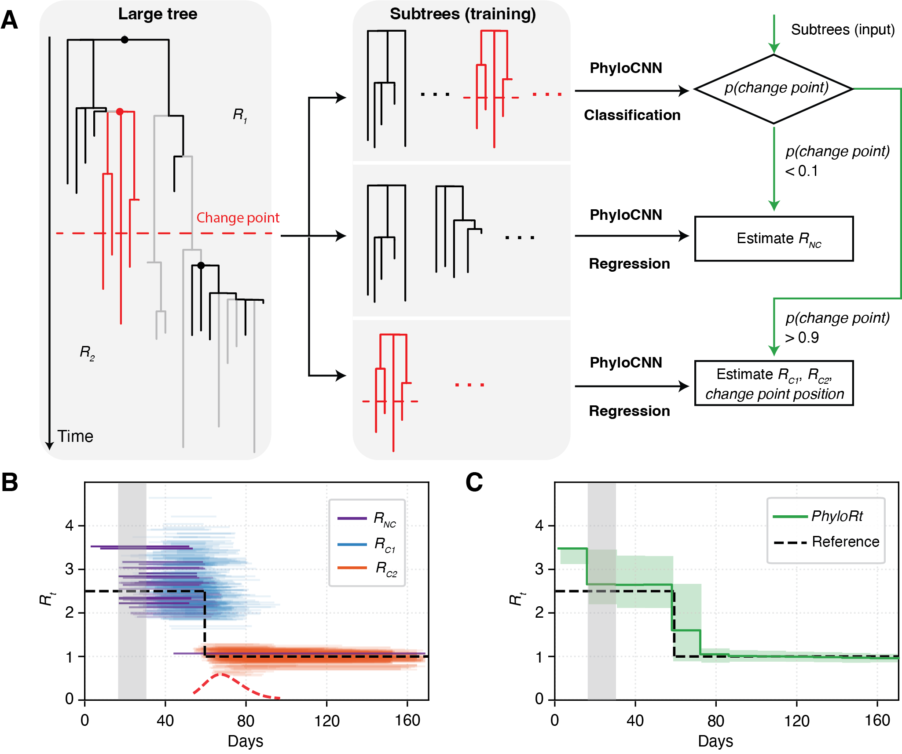

# PhyloRt

PhyloRt is a Python toolkit for estimating time-varying reproduction numbers (R<sub>t</sub>) from outbreak phylogenies using a scalable deep-learning workflow.



## Installation

Python requirement: `>=3.10`

Clone the repository, then install PhyloRt:

```bash
git clone https://github.com/xieruopeng/PhyloRt.git
cd PhyloRt
pip install -e .
```

Optional [conda](https://docs.conda.io) workflow:

```bash
git clone https://github.com/xieruopeng/PhyloRt.git
cd PhyloRt
conda create -n phyloenv python=3.10 -y
conda activate phyloenv
pip install -e .
```

## Quick Start

Run the default end-to-end workflow:

```bash
PhyloRt \
  --tree tree.nwk \
  --date-file dates.tsv \
  --sampling 0.03 \
  --pre-model FLUB \
  --out-dir results
```

This command writes dated trees, extracted metadata, and default plots to `results/`.

## Input Requirements

- `--tree`: genetic-distance Newick file (single or multiple trees).
  - Genetic-distance trees are automatically time-scaled using LSD2 with [pathogen-specific clock rates](PhyloRt/transform/pathogens.py) and [predefined branch settings](PhyloRt/transform/dating.py) to match the training conditions used by PhyloRt.
- `--date-file`: tab-separated `tip_name<TAB>YYYY-MM-DD`.
- `--pre-model`: one of `FLUB`, `H3N2`, `H1N1`, `RSVA`, `RSVB`, `COVID`.
  - For H1N1, RSVA, and RSVB, trees are dated using their pathogen-specific clock rates, while inference is performed using the compatible H3N2 neural-network models.
- `--sampling`: one or more sampling proportions.
- `--sampling-times`: boundaries (required when multiple sampling proportions are used).

## External Dependencies

For full pipeline runs, make sure these executables are on your `PATH`:

- [`lsd2`](https://github.com/tothuhien/lsd2)
- [`gotree`](https://github.com/evolbioinfo/gotree)

These are external command-line tools (not Python packages), so they are not
declared in `pyproject.toml` dependencies.

You can also pass explicit paths with `--lsd2-bin` and `--gotree-bin`.

## Current Scope

The current PhyloRt release supports the major respiratory virus groups currently bundled in the toolkit (`COVID`, `FLUB`, `H3N2`, `H1N1`, `RSVA`, `RSVB`) and uses LSD2-based tree dating as the supported time-scaling workflow.

We are happy to expand PhyloRt to additional pathogens and dating workflows. If you are interested, please open an issue or contact the [maintainers](mailto:rpxie@connect.hku.hk).

## Example Datasets

Reproducible example inputs and command templates are under [`examples/`](examples/).

- [`examples/flub_China/`](examples/flub_China/)
- [`examples/COVID_UK/`](examples/COVID_UK/)

See [`examples/README.md`](examples/README.md) for runnable commands.

## Repository Structure

```text
PhyloRt/
  PhyloRt/              # Python package
    prediction/         # feature extraction and model inference
    transform/          # dating and tree transformations
    plotting/           # Rt and subtree visualizations
    clock_rates/        # pathogen-specific clock-rate defaults
  examples/             # sample inputs and commands
  simulators/           # simulation-side tree conversion utilities
  tests/                # unit/integration tests
```

## Citation

If you use PhyloRt, please cite: *Scalable deep-learning-based inference of time-varying transmission dynamics from outbreak phylogenies* — [https://doi.org/10.64898/2026.05.07.26352673](https://doi.org/10.64898/2026.05.07.26352673).

## License

Released under the MIT License. See [`LICENSE`](LICENSE).


