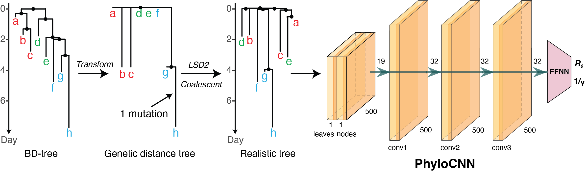

# Simulating Training Trees

This folder contains the simulation workflow used to generate realistic,
pathogen-specific phylogenies for neural-network model training.



## Required External Tools

- `generate_bdei` or `generate_mtbd` from treesimulator ([GitHub](https://github.com/evolbioinfo/treesimulator))
- `lsd2` ([GitHub](https://github.com/tothuhien/lsd2))
- `gotree` ([GitHub](https://github.com/evolbioinfo/gotree))


## BDEI Example

This example simulates a BDEI tree and converts it using H3N2-like genome
length and substitution-rate parameters.

```bash
mkdir -p runs/bdei

generate_bdei \
  --min_tips 20 \
  --max_tips 500 \
  --la 0.2145 \
  --mu 0.5 \
  --psi 0.143 \
  --p 0.2 \
  --nwk runs/bdei/simulated_tree.nwk \
  --log runs/bdei/parameters.csv

python simulators/convert_simulated_tree.py \
  --tree runs/bdei/simulated_tree.nwk \
  --output-tree runs/bdei/simulated_tree.lsd2.nwk \
  --seq-length 1737 \
  --clock-rate-mean 0.005 \
  --clock-rate-sd 0.000102
```

## BDEISS Example

This example simulates a BDEISS-style four-state tree with `generate_mtbd` and
converts it using SARS-CoV-2-like genome length and substitution-rate
parameters.

```bash
mkdir -p runs/bdeiss

generate_mtbd \
  --min_tips 20 \
  --max_tips 500 \
  --nwk runs/bdeiss/simulated_tree.nwk \
  --log runs/bdeiss/parameters.csv \
  --states ES EN IS IN \
  --transition_rates 0 0 0.5 0 \
  0 0 0 0.5 \
  0 0 0 0 \
  0 0 0 0 \
  --transmission_rates 0 0 0 0 \
  0 0 0 0 \
  0.134 1.206 0 0 \
  0.009 0.08 0 0 \
  --removal_rates 0 0 0.143 0.143 \
  --sampling_probabilities 0 0 0.2 0.2

python simulators/convert_simulated_tree.py \
  --tree runs/bdeiss/simulated_tree.nwk \
  --output-tree runs/bdeiss/simulated_tree.lsd2.nwk \
  --seq-length 29903 \
  --clock-rate-mean 0.0008 \
  --clock-rate-sd 0.0004
```

The resulting `simulated_tree.lsd2.nwk` is the realistic dated tree used as
input to [PhyloCNN](https://github.com/manolofperez/phyloCNN).